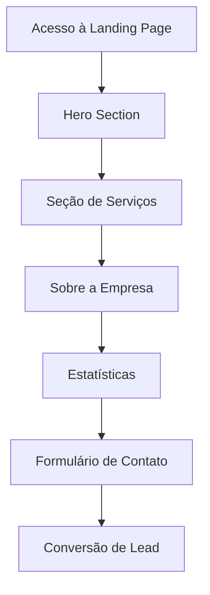

# Documentação de Requisitos - Landing Page Idealium

## 1. Visão Geral do Produto

Landing page moderna para empresa de investimentos Idealium, com design escuro e acentos em verde, focada em conversão de leads e apresentação de serviços financeiros. A página deve transmitir confiança, profissionalismo e inovação no setor de investimentos.

## 2. Funcionalidades Principais

### 2.1 Papéis de Usuário

| Papel | Método de Registro | Permissões Principais |
|-------|-------------------|----------------------|
| Visitante | Acesso direto | Visualizar conteúdo, preencher formulários de contato |
| Lead Qualificado | Formulário de contato | Receber materiais informativos e contato comercial |

### 2.2 Módulos de Funcionalidade

Nossa landing page consiste nas seguintes páginas principais:
1. **Página Principal**: header com navegação, hero section, seções de serviços, estatísticas, sobre a empresa, contato e footer.

### 2.3 Detalhes das Páginas

| Nome da Página | Nome do Módulo | Descrição da Funcionalidade |
|----------------|----------------|-----------------------------|
| Página Principal | Header/Navegação | Menu de navegação responsivo com logo Idealium, links para seções e botão CTA |
| Página Principal | Hero Section | Título principal "Ganhe sua liberdade de pré-aposentadoria", subtítulo explicativo, estatística "200% em uma IA que vende sem parar", botão de ação principal |
| Página Principal | Seção de Serviços | Cards com ícones apresentando os principais serviços: consultoria financeira, gestão de portfólio, análise de mercado |
| Página Principal | Seção Sobre | Apresentação da empresa com texto explicativo e diagrama de fluxo de trabalho |
| Página Principal | Seção de Estatísticas | Métricas de performance em cards: clientes atendidos, retorno médio, anos de experiência, projetos concluídos |
| Página Principal | Seção de Benefícios | Lista de vantagens e diferenciais da empresa com ícones ilustrativos |
| Página Principal | Formulário de Contato | Campos para nome, email, telefone, mensagem e botão de envio |
| Página Principal | Footer | Links de navegação, redes sociais, informações de contato e logo da empresa |

## 3. Processo Principal

Fluxo principal do usuário:
1. Usuário acessa a landing page
2. Visualiza o hero section com proposta de valor
3. Navega pelas seções de serviços e benefícios
4. Analisa estatísticas e cases de sucesso
5. Preenche formulário de contato para mais informações
6. Recebe contato da equipe comercial

## 4. Design da Interface do Usuário

### 4.1 Estilo de Design

- **Cores primárias**: Verde (#00FF88, #00CC6A) e preto (#000000, #1a1a1a)
- **Cores secundárias**: Cinza escuro (#2a2a2a, #333333) e branco (#FFFFFF)
- **Estilo de botões**: Bordas arredondadas, gradiente verde, efeitos hover
- **Fonte**: Sans-serif moderna, tamanhos hierárquicos (H1: 48px, H2: 36px, H3: 24px, corpo: 16px)
- **Layout**: Design em grid, cards com bordas sutis, espaçamento generoso
- **Ícones**: Estilo minimalista, linha fina, cor verde para destaque

### 4.2 Visão Geral do Design das Páginas

| Nome da Página | Nome do Módulo | Elementos da UI |
|----------------|----------------|----------------|
| Página Principal | Header | Logo Idealium (verde), menu horizontal, botão CTA verde com bordas arredondadas |
| Página Principal | Hero Section | Background escuro com padrão geométrico sutil, título em branco grande, estatística destacada em verde, botão principal com gradiente |
| Página Principal | Seção de Serviços | Cards em grid 3x1, ícones verdes, texto branco sobre fundo escuro, bordas sutis |
| Página Principal | Seção Sobre | Layout duas colunas, texto à esquerda, diagrama de fluxo à direita com elementos azuis e verdes |
| Página Principal | Estatísticas | Cards em linha com números grandes em verde, descrições em branco, ícones ilustrativos |
| Página Principal | Formulário | Campos com bordas verdes, labels flutuantes, botão de envio com gradiente verde |
| Página Principal | Footer | Background preto, links em branco, ícones de redes sociais verdes, layout em colunas |

### 4.3 Responsividade

Design mobile-first com adaptação para desktop, otimização para touch em dispositivos móveis, breakpoints em 768px e 1024px.