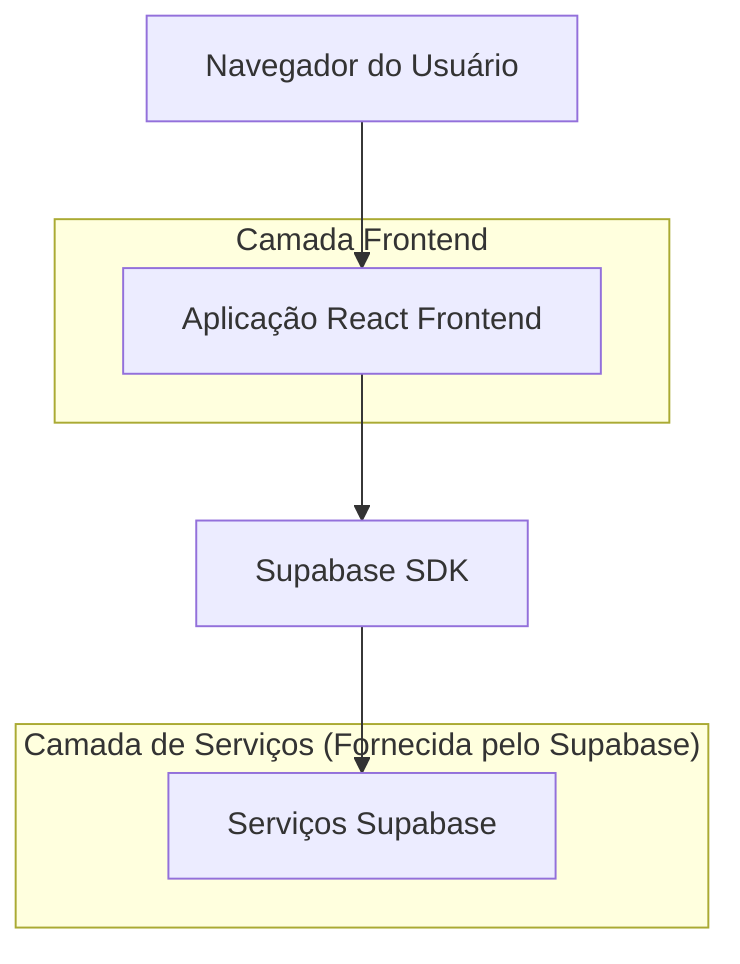
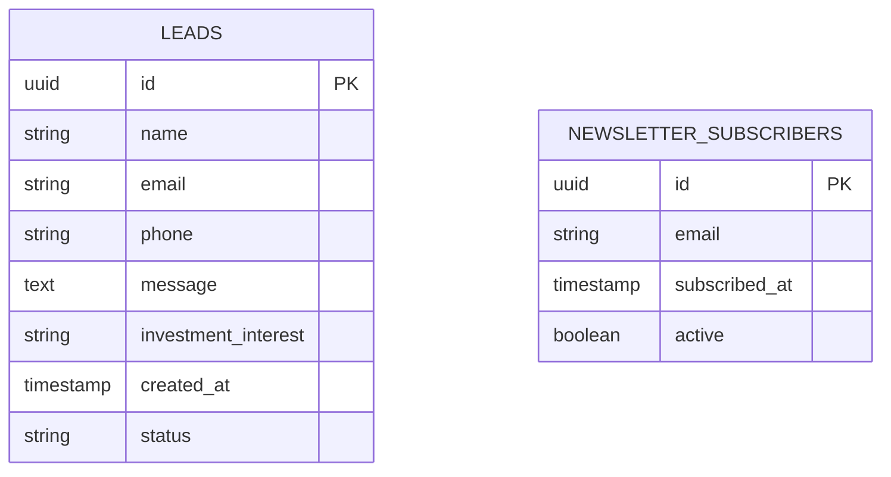

# Arquitetura Técnica - Landing Page Idealium

## 1. Design da Arquitetura



## 2. Descrição das Tecnologias

- Frontend: React@18 + TailwindCSS@3 + Vite
- Backend: Supabase (autenticação, banco de dados, storage)
- Animações: Framer Motion
- Ícones: Lucide React
- Formulários: React Hook Form

## 3. Definições de Rotas

| Rota | Propósito |
|------|----------|
| / | Página principal da landing page com todas as seções |
| /obrigado | Página de agradecimento após envio do formulário |
| /politica-privacidade | Página com política de privacidade |
| /termos-uso | Página com termos de uso |

## 4. Definições de API

### 4.1 API Principal

Envio de formulário de contato
```
POST /api/contact
```

Request:
| Nome do Parâmetro | Tipo do Parâmetro | Obrigatório | Descrição |
|-------------------|-------------------|-------------|----------|
| name | string | true | Nome completo do interessado |
| email | string | true | Email para contato |
| phone | string | true | Telefone para contato |
| message | string | false | Mensagem adicional |
| investment_interest | string | false | Tipo de investimento de interesse |

Response:
| Nome do Parâmetro | Tipo do Parâmetro | Descrição |
|-------------------|-------------------|----------|
| success | boolean | Status do envio |
| message | string | Mensagem de confirmação |
| lead_id | string | ID do lead gerado |

Exemplo:
```json
{
  "name": "João Silva",
  "email": "joao@email.com",
  "phone": "(11) 99999-9999",
  "message": "Gostaria de saber mais sobre investimentos",
  "investment_interest": "renda_fixa"
}
```

## 5. Modelo de Dados

### 5.1 Definição do Modelo de Dados



### 5.2 Linguagem de Definição de Dados

Tabela de Leads (leads)
```sql
-- criar tabela
CREATE TABLE leads (
    id UUID PRIMARY KEY DEFAULT gen_random_uuid(),
    name VARCHAR(255) NOT NULL,
    email VARCHAR(255) NOT NULL,
    phone VARCHAR(20) NOT NULL,
    message TEXT,
    investment_interest VARCHAR(50),
    status VARCHAR(20) DEFAULT 'new' CHECK (status IN ('new', 'contacted', 'qualified', 'converted')),
    created_at TIMESTAMP WITH TIME ZONE DEFAULT NOW(),
    updated_at TIMESTAMP WITH TIME ZONE DEFAULT NOW()
);

-- criar índices
CREATE INDEX idx_leads_email ON leads(email);
CREATE INDEX idx_leads_created_at ON leads(created_at DESC);
CREATE INDEX idx_leads_status ON leads(status);

-- permissões Supabase
GRANT SELECT ON leads TO anon;
GRANT ALL PRIVILEGES ON leads TO authenticated;

-- dados iniciais
INSERT INTO leads (name, email, phone, message, investment_interest, status)
VALUES 
('João Silva', 'joao@email.com', '(11) 99999-9999', 'Interesse em renda fixa', 'renda_fixa', 'new'),
('Maria Santos', 'maria@email.com', '(11) 88888-8888', 'Quero diversificar meus investimentos', 'acoes', 'contacted');
```

Tabela de Newsletter (newsletter_subscribers)
```sql
-- criar tabela
CREATE TABLE newsletter_subscribers (
    id UUID PRIMARY KEY DEFAULT gen_random_uuid(),
    email VARCHAR(255) UNIQUE NOT NULL,
    subscribed_at TIMESTAMP WITH TIME ZONE DEFAULT NOW(),
    active BOOLEAN DEFAULT true
);

-- criar índices
CREATE INDEX idx_newsletter_email ON newsletter_subscribers(email);
CREATE INDEX idx_newsletter_subscribed_at ON newsletter_subscribers(subscribed_at DESC);

-- permissões Supabase
GRANT SELECT ON newsletter_subscribers TO anon;
GRANT ALL PRIVILEGES ON newsletter_subscribers TO authenticated;
```